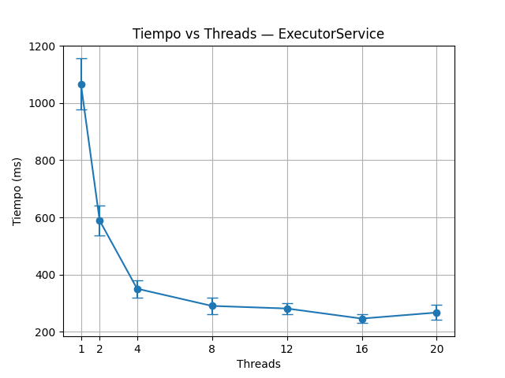
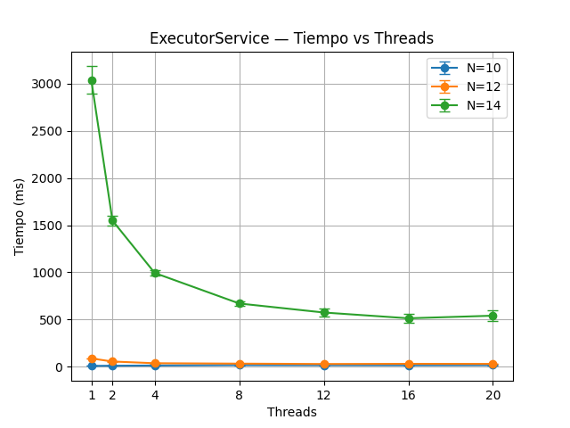
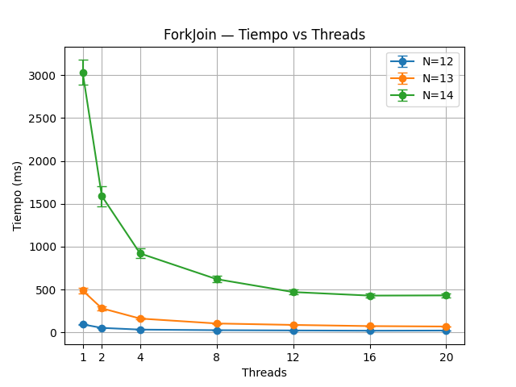
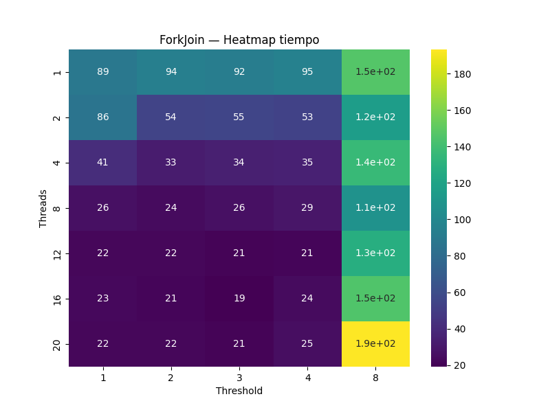
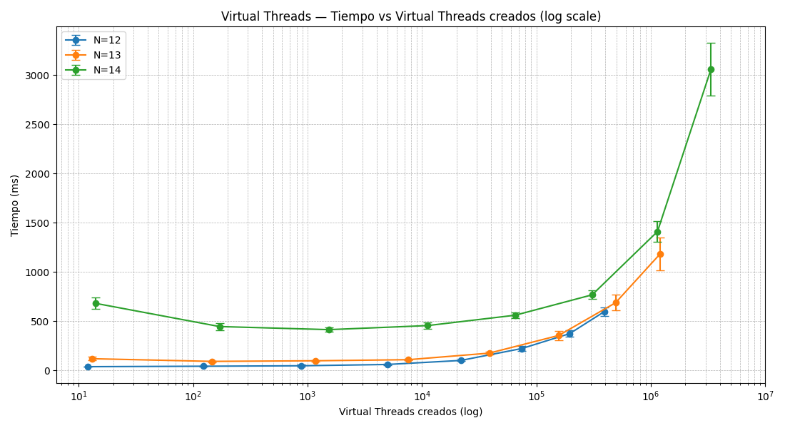
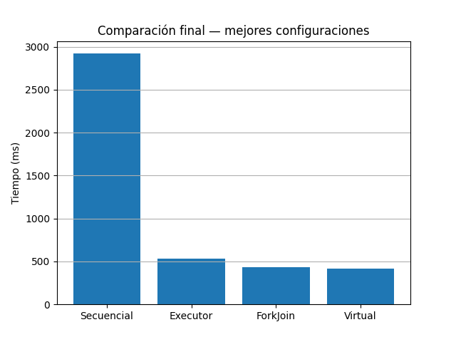

# Actividad Java
Implementaciones secuenciales y paralelas para multiplicación de matrices y N-Queens.

## Hardware y entorno  
**CPU:** AMD Ryzen AI 9 365 — 10 núcleos — ~1996 MHz  
**SO:** Ubuntu 22.04 (WSL2)  
**Java:** OpenJDK 21


## Punto a - Versión secuencial  
**Archivo:** [`src/matrix/MatrixSequential.java`](src/matrix/MatrixSequential.java)

### Puntos importantes  
- Implementa la multiplicación de matrices 1024×1024 usando triple bucle como en el ejemplo de la consigna.  
- Las matrices se inicializan de forma determinística con `Random(SEED)`.  
- Imprime `C[0][0]` como verificación del resultado y el tiempo de ejecución.

### Cómo ejecutarlo  
Desde el directorio del proyecto:

```bash
./scripts/run_matrix_sequential.sh
```

### Salida esperada

```
Compilando MatrixSequential...
Ejecutando MatrixSequential...
--------------------------------
Fin: 253.90358035476618
Tiempo (ms): 1991.526451
--------------------------------
Ejecución finalizada.
```

## Punto b - Versión paralela con ExecutorService  
**Archivo:** [`src/matrix/MatrixExecutor.java`](src/matrix/MatrixExecutor.java)

### Puntos importantes  
- Paraleliza el cálculo por **filas**, enviando cada una como tarea al `ExecutorService` con la funcion `executor.submit`.  
  **Justificación:** Se paraleliza por filas porque cada una se puede calcular de manera completamente independiente y permite generar una cantidad razonable de tareas (una por fila). Paralelizar por columnas también sería igualmente válido. Paralelizar por celdas produciría un número excesivo de tareas muy pequeñas, y paralelizar el bucle interno `k` no tiene sentido conceptual, ya que ese bucle calcula un único valor `C[i][j]`.
 
- Permite configurar la cantidad de hilos desde línea de comandos (primer argumento).  
- Produce el mismo resultado que la versión secuencial y muestra el tiempo de ejecución y la cantidad de hilos utilizados.

### Cómo ejecutarlo  
Con cantidad de hilos específica (ejemplo: 8):

```bash
./scripts/run_matrix_executor.sh 8
```

O usando el valor por defecto (todos los cores disponibles):

```bash
./scripts/run_matrix_executor.sh
```

### Salida esperada
```
Compilando MatrixExecutor...
Ejecutando MatrixExecutor...
--------------------------------
Fin: 253.90358035476618
Tiempo (ms): 366.863845
Threads usados: 8
--------------------------------
Ejecución finalizada.
```

## Punto c - Versión paralela con ForkJoin  
**Archivo:** [`src/matrix/MatrixForkJoin.java`](src/matrix/MatrixForkJoin.java)

### Puntos importantes  
- Implementa paralelismo usando el framework **ForkJoin**, A diferencia de un ExecutorService, el ForkJoinPool implementa work stealing, lo cual permite balancear dinámicamente subtareas entre threads cuando algunos terminan antes que otros.
- El threshold determina cuántas filas de la matriz C se procesan en forma secuencial dentro de una sola tarea ForkJoin.
- El patrón divide & conquer aparece en el método `compute()`, donde se hace crean 2 tareas nuevas cuando `rows > threshold`, la tarea se parte exactamente a la mitad generando dos subtareas y asi recursivamente hasta llegar al valor del threshold.
- Permite ajustar tanto la cantidad de hilos como el `threshold` desde la línea de comandos.  
- Produce el mismo resultado que las versiones anteriores y muestra el tiempo de ejecución, los hilos utilizados y el threshold aplicado.

### Cómo ejecutarlo  
Con cantidad de hilos y threshold específicos (ejemplo: 8 hilos, threshold 64):

```bash
./scripts/run_matrix_forkjoin.sh 8 64
```

Usando valores por defecto (todos los cores disponibles y threshold = 64):

```bash
./scripts/run_matrix_forkjoin.sh
```

### Salida esperada

```
Compilando MatrixForkJoin...
Ejecutando MatrixForkJoin...
--------------------------------
Fin: 253.90358035476618
Tiempo (ms): 473.427032
Threads usados: 8
Threshold: 64
--------------------------------
Ejecución finalizada.
```

## Punto e - Versión paralela con Virtual Threads  
**Archivo:** [`src/matrix/MatrixVirtual.java`](src/matrix/MatrixVirtual.java)

### Puntos importantes  
- Reimplementa la versión del punto **b)** reemplazando el `ExecutorService` por **virtual threads** utilizando `Thread.startVirtualThread`.  
- Mantiene la misma estrategia de paralelización por filas, pero permite crear cientos o miles de hilos sin costo alto, gracias a que los virtual threads son gestionados por la JVM y no por el sistema operativo.  
- Permite configurar la cantidad de virtual threads desde línea de comandos; si no se indica, se utiliza una virtual thread por fila (1024).  
- Produce el mismo resultado que las versiones anteriores e informa el tiempo de ejecución y la cantidad de hilos virtuales utilizados.

### Cómo ejecutarlo  
Con cantidad específica de virtual threads (ejemplo: 20):

```bash
./scripts/run_matrix_virtual.sh 20
```

Usando valor por defecto (1024 virtual threads, una por fila):

```bash
./scripts/run_matrix_virtual.sh
```

### Salida esperada

```
Compilando MatrixVirtual...
Ejecutando MatrixVirtual...
--------------------------------
Fin: 253.90358035476618
Tiempo (ms): 373.285158
Virtual threads usados: 1024
--------------------------------
Ejecución finalizada.
```

## Punto d - Comparación de tiempos de ejecución  
Para evaluar el rendimiento de las distintas variantes (secuencial, ExecutorService, ForkJoin y Virtual Threads) se desarrolló el script `scripts/benchmarks-matrix.py`, que automatiza todo el proceso de medición y generacion de graficos.

### Cómo funciona el script de benchmarks  
- Ejecuta cada implementación **varias veces** (por defecto 50 runs por configuración) para estimar un tiempo promedio confiable.  
- Calcula automáticamente:
  - **tiempo promedio** de ejecución (mean)  
  - **desvío estándar** (std)  
- Repite las pruebas variando:
  - **cantidad de threads** para ExecutorService  
  - **cantidad de threads y thresholds** para ForkJoin  
  - **cantidad de virtual threads** para la variante con virtual threads  
- Genera gráficos comparativos con **barras de error** para visualizar la variabilidad de los resultados.  
- Produce un gráfico final comparando las **mejores configuraciones** de cada método.

### Sobre la cantidad de ejecuciones  
Se utilizaron **50 ejecuciones por configuración**, lo cual reduce significativamente la variabilidad estadística.  
Se consideró realizar más, pero el costo temporal total aumentaba demasiado.

### Cómo ejecutar el benchmark  
Desde el entorno virtual Python:

```bash
source .venv/bin/activate
python3 scripts/benchmarks-matrix.py
```

Los gráficos generados se guardan automáticamente en el directorio `/plots_matrix`

Se pueden variar las configuraciones cambiando la seccion al comienzo del script, las configuraciones utilizadas para los graficos fueron las siguientes:
```python
N_RUNS = 50   # cantidad de ejecuciones para promediar

EXECUTOR_THREADS = [1, 2, 4, 8, 12, 16, 20]
FORKJOIN_THREADS = [1, 2, 4, 8, 12, 16, 20]
FORKJOIN_THRESHOLDS = [16, 32, 64, 128]
VIRTUAL_THREADS = [1, 2, 4, 8, 16, 32, 64, 256, 512, 1024]
```

A continuación se presentan los resultados obtenidos y las conclusiones derivadas de cada gráfico.

### Resultados - ExecutorService



El gráfico muestra cómo varía el tiempo de ejecución al aumentar la cantidad de threads utilizados en la versión paralela con `ExecutorService`.

#### Observaciones principales
- Con **1 thread**, obtenemos el mayor tiempo de ejecucion por gran diferencia.
- El tiempo cae drásticamente al pasar a **2 threads** (~600 ms) y vuelve a reducirse con **4 threads** (~380 ms).
- A partir de **8 threads**, el tiempo se estabiliza entre **250–300 ms**.
- El mejor tiempo medido ocurre alrededor de **16 threads**, con un valor cercano a **250 ms**.

#### Conclusión
El rendimiento mejora significativamente hasta aproximadamente **8 threads**, luego se estabiliza.

### Resultados - ForkJoin


El gráfico muestra el tiempo de ejecución para la versión paralela usando el framework **ForkJoin**, evaluando combinaciones de distintos valores de `threads` y `threshold`.

#### Observaciones principales

- Con **1 thread**, el rendimiento es muy similar al de ExecutorService, superando los **1000 ms**.
- Con **2 threads**, el tiempo cae por debajo de **600 ms**, como en la versión del ExecutorService.
- Entre **4 y 8 threads**, los tiempos nuevamente descienden y se ubican en el rango **400–360 ms**, dependiendo del threshold.
- El mejor desempeño se observa alrededor de **12–16 threads**, donde varios thresholds convergen en valores cercanos a **260–300 ms**.
- El threshold **128** es consistentemente el peor de todos ya que produce los mayores tiempos en todos los niveles de threads debido a que **reduce demasiado la granularidad y genera tareas demasiado grandes**.
- En cambio, los thresholds **16, 32 y 64** tienen desempeños parecidos y buenos, con pequeñas diferencias entre ellos.

#### Conclusión
El framework ForkJoin muestra un patrón muy similar al del ExecutorService: mejora rápida al incrementar la cantidad de hilos hasta aproximadamente **12–16**, donde obtiene su mejor rendimiento. Thresholds demasiado grandes (como 128) perjudican la performance al limitar el grado de división del trabajo. Thresholds más pequeños (16–64) funcionan mejor y producen resultados prácticamente equivalentes entre sí.

En general, ForkJoin no ofrece una ventaja significativa sobre ExecutorService para este problema específico, ya que la multiplicación por filas no se beneficia demasiado del enfoque *divide and conquer*. Sin embargo, demuestra estabilidad y buen rendimiento con thresholds adecuados.

### Resultados - Virtual Threads


Este gráfico muestra cómo varía el tiempo de ejecución al utilizar **virtual threads**, usando una escala logarítmica en el eje X para visualizar adecuadamente configuraciones desde 1 hasta 1024 hilos virtuales.

#### Observaciones principales

- Con **1 virtual thread**, el desempeño es similar a la versión secuencial, superando los **1200 ms**.
- Al aumentar a **2 y 4 virtual threads**, el tiempo cae rápidamente a la región de **600–400 ms**, mostrando un patrón de aceleración muy similar al de los hilos tradicionales.
- A partir de **8 virtual threads**, el tiempo baja a alrededor de **350 ms**, comparable al ExecutorService y ForkJoin.
- A partir de **16 virtual threads** y hasta **1024**, el tiempo se mantiene prácticamente estable entre **230–280 ms**, mostrando que:
  - El scheduling de virtual threads escala muy bien.
  - Crear cientos o miles de virtual threads **no introduce penalidades significativas**.
- El mejor tiempo medido se encuentra alrededor de **1024 virtual threads**, cercano a **230ms**.

#### Conclusión
Los virtual threads muestran un comportamiento de escalabilidad muy estable. A diferencia de los hilos tradicionales, donde el overhead del sistema operativo limita la creacion de threads hasta cierto punto, los virtual threads permiten crear cientos o miles de hilos sin costo significativo. Esto produce:

- Rendimiento levemente mejor que ExecutorService y ForkJoin.
- Muy poco overhead agregado incluso con **1024 hilos virtuales**, algo impráctico con platform threads.

En este problema particular, los virtual threads logran un rendimiento **apenas superior** porque no aumentan el paralelismo de hardware (siguen ejecutándose sobre la misma cantidad fija de núcleos) y, además, no existe I/O bloqueante que justifique su modelo de concurrencia. Como el trabajo es completamente CPU-bound, crear más virtual threads no aporta una mejora adicional.

### Comparación final - Mejores configuraciones


El gráfico resume el mejor desempeño alcanzado por cada implementación:

- **Secuencial:** ~1200 ms  
- **ExecutorService (16 threads):** ~250 ms  
- **ForkJoin (20 threads, threshold=16):** ~270 ms  
- **Virtual Threads (1024 threads):** ~250 ms  

#### Observaciones principales

- La versión secuencial es la más lenta con una diferencia marcada respecto de todas las demás alternativas paralelas.
- Tanto ExecutorService como ForkJoin logran tiempos muy similares, alrededor de **250ms**, lo cual confirma que el problema (multiplicación de matrices por filas) no se beneficia especialmente del enfoque divide-and-conquer de ForkJoin.
- La variante con **virtual threads** alcanzó un tiempo muy similar al del ExecutorService, demostrando que los virtual threads escalan de forma eficiente y que el costo de crear cientos o miles de hilos virtuales es bajo.
- El desvío estándar en las versiones paralelas es bajo, reflejando una estabilidad temporal consistente.

#### Conclusión general del punto d)

Las tres variantes paralelas logran una gran mejora de aproximadamente respecto de la versión secuencial.  
ExecutorService, ForkJoin y Virtual Threads ofrecen desempeños similares, ademas los virtual threads muestran un comportamiento estable incluso con cantidades muy grandes de hilos.

## Punto f - Nqueens

Se repiten todos los puntos realizados para el problema de Nqueens.

### N-Queens secuencial

Archivo: [`src/nqueens/NQueensSequential.java`](src/nqueens/NQueensSequential.java)

#### Puntos importantes

- Implementa el algoritmo clásico de backtracking para resolver el problema de N-Queens
- isSafe() replica exactamente la lógica del código en C de la primera consigna.
- N es configurable por argumento, permitiendo evaluar distintos tamaños.
- Imprime el número total de soluciones y el tiempo de ejecución

#### Cómo ejecutarlo

Ejemplo con N = 12:
```bash
./scripts/run_nqueens_sequential.sh 12
```
Salida esperada:
```
Ejecutando NQueensSequential con N=12...
--------------------------------
Soluciones para 12 reinas: 14200
Tiempo (ms): 125.533362
--------------------------------
Ejecución finalizada.
```

### N-Queens ExecutorService

Archivo: [`src/nqueens/NQueensExecutor.java`](src/nqueens/NQueensExecutor.java)

#### Puntos importantes

- Se paraleliza únicamente la fila inicial (fila 0) porque cada elección de columna en esa fila genera un subárbol de búsqueda independiente del problema N-Queens. Paralelizar en este nivel distribuye subárboles completos entre los hilos, logrando un buen equilibrio entre paralelismo y overhead. Se podria paralelizar a niveles más profundos, cuidando no profundizar de mas ya que llegado a cierto nivel no aporta beneficios, ya que generaría un número excesivo de tareas muy pequeñas y aumentaría innecesariamente el costo de administración del paralelismo, como vimos en el trabajo anterior.
- `submit()` lanza tareas paralelas y devuelve un Future por cada una.
- Los futures se guardan en una lista para esperar a todas las tareas.
- `get()` obtiene el resultado de cada cálculo y sincroniza la ejecución.
- Como la paralelización realiza únicamente N tareas independientes (una por cada columna posible en la primera fila), aumentar la cantidad de threads más allá de N no produce más trabajo para distribuir. De forma inversa, usar menos threads que tareas sigue funcionando, pero limita el máximo grado de paralelismo.

- El número de threads se configura desde línea de comandos.

- Cada tarea ejecuta el backtracking restante de forma secuencial.

- Se suman los resultados devueltos por cada Future<Long>.


#### Cómo ejecutarlo

Ejemplo con 8 hilos y N = 12:

```bash
./scripts/run_nqueens_executor.sh 8 12
```

#### Salida esperada

```
Compilando NQueensExecutor...
Ejecutando NQueensExecutor con 8 threads, N=12...
--------------------------------
Soluciones para 12 reinas: 14200
Tiempo (ms): 51.295386
Threads usados: 8
--------------------------------
Ejecución finalizada.
```

### N-Queens ForkJoin

Archivo: [`src/nqueens/NQueensForkJoin.java`](src/nqueens/NQueensForkJoin.java)

#### Puntos importantes

- Implementa una versión paralela usando el framework ForkJoin, aplicando el patrón divide & conquer.

- Se utiliza un threshold que define hasta qué profundidad del árbol de N-Queens se generan tareas paralelas:
  - Si `row < threshold` → se crean subtareas (`fork`).
  - Si `row ≥ threshold` → continúa secuencialmente.
- El N del tablero, número de hilos y el threshold se pueden configurar desde la línea de comandos.

#### Cómo ejecutarlo

Ejemplo usando 8 hilos, N=12 y threshold=2:
```bash
./scripts/run_nqueens_forkjoin.sh 8 12 2
```

#### Salida esperada

```
Compilando NQueensForkJoin...
Ejecutando NQueensForkJoin con 8 threads, N=12, threshold=2
--------------------------------
Soluciones para 12 reinas: 14200
Tiempo (ms): 24.135887
Threads usados: 8
Threshold usado: 2
--------------------------------
Ejecución finalizada.
```


### N-Queens con Virtual Threads

Archivo: [`src/nqueens/NQueensVirtual.java`](src/nqueens/NQueensVirtual.java)

#### Puntos importantes

- Implementa una versión paralela utilizando Virtual Threads con `Executors.newThreadPerTaskExecutor(...)`, que ejecutá cada tarea en su propio virtual thread independiente.

- Ya no se configura la cantidad de virtual threads por parámetro, sino que se deriva del parametro threshold, el cual indica la profundidad hasta la cual se paraleliza.

- Para contar adecuadamente la cantidad de threads se utiliza `AtomicInteger VT_COUNT` junto con (aca tambien se especifican que sean virtual threads):
```java
        ThreadFactory baseFactory = Thread.ofVirtual()
                .name("vthread-", 0)
                .factory();

        ThreadFactory countingFactory = runnable -> {
            VT_COUNT.incrementAndGet();
            return baseFactory.newThread(runnable);
        };

        EXECUTOR = Executors.newThreadPerTaskExecutor(countingFactory);
```
- Se utiliza un `AtomicInteger` ya que es estan creando virtual threads en paralelo desde múltiples tareas, y por lo tanto el contador de threads debe ser thread-safe.

- Se usa un threshold que define hasta qué profundidad del árbol se generan tareas paralelas.

  - Si row < threshold → se crean mini-tareas en virtual threads.

  - Si row ≥ threshold → el backtracking continúa de forma secuencial.

- Permite configurar por línea de comandos la cantidad de virtual threads a usar, el valor de N y el threshold.

#### Cómo ejecutarlo

Ejemplo usando N=12 y threshold=2:

```bash
./scripts/run_nqueens_virtual.sh 12 2
```

#### Salida esperada

```
Compilando NQueensVirtual...
Ejecutando NQueensVirtual con N=12, threshold=2
--------------------------------
=== NQueensVirtual (count VT) ===
N=12, threshold=2
Tiempo (ms): 67.360695
Soluciones: 14200
Virtual threads realmente creados: 122
--------------------------------
Ejecución finalizada.
```


### Comparación de tiempos de ejecución para N-Queens

Para evaluar el rendimiento de las variantes secuencial, ExecutorService, ForkJoin y Virtual Threads aplicadas al problema de N-Queens, se desarrolló el script scripts/benchmarks-nqueens.py, el cual automatiza completamente la ejecución y generación de gráficos.

#### Cómo funciona el script de benchmarks

Ejecuta cada implementación varias veces (por defecto 10 runs por configuración) para obtener un tiempo promedio estable.

Para cada combinación mide:
- Tiempo promedio (mean)
- Desvío estándar (std)

Para ExecutorService se varia:
- Número de threads reales
- Tamaño del problema 

Para ForkJoin se varia:
- Número de threads.
- Threshold de paralelización 
- Tamaño del problema

Para Virtual Threads 
- Solo se varía el threshold, que controla cuántas subtareas paralelas se generan.

Genera:
- Gráficos “tiempo vs threads” para ExecutorService
- Gráficos “tiempo vs threads” para ForkJoin
- Gráficos “tiempo vs virtual threads creados”
- Heatmaps de tiempo para combinaciones threads × threshold para forkjoin
- Un gráfico final comparando las mejores configuraciones de cada método

Todos los gráficos incluyen barras de error reflejando la variabilidad de las ejecuciones.


#### Cómo ejecutar el benchmark

```bash
python3 scripts/benchmarks-nqueens.py
```

Esto generará todos los gráficos dentro del directorio:
```
plots_nqueens/
```


#### Configuraciones utilizadas

```python
N_RUNS = 10

THREAD_COUNTS = [1, 2, 4, 8, 12, 16, 20]
N_VALUES = [12, 13, 14]

HEATMAP_THREADS = [1, 2, 4, 8, 12, 16, 20]
HEATMAP_THRESHOLDS = [1, 2, 4, 8, 12]

VIRTUAL_THRESHOLDS = [1, 2, 3, 4, 5, 6, 7, 8]
```

#### Resultados - ExecutorService (N-Queens)



El gráfico muestra cómo varía el tiempo de ejecución en la versión paralela con ExecutorService al aumentar la cantidad de threads, evaluado sobre distintos tamaños del problema N.

#### Observaciones principales

- Para `N = 12` aumentar la cantidad de threads produce mejoras poco visibles.

- Para `N = 13` aumentar la cantidad de threads produce mejoras un poco mas visibles.

- Para `N = 14`, el tiempo cae fuertemente al aumentar los threads.

- A partir de una cantidad de threads la curva se estabiliza y no hay mayor beneficio en seguir aumentando la cantidad.

#### Conclusión

- El rendimiento de ExecutorService mejora fuertemente para N más grandes (especialmente N=14).

- Para instancias pequeñas (N=12) no hay beneficio claro en la paralelizacion.


#### Resultados - Forkjoin (N-Queens)



Este gráfico muestra cómo varía el tiempo de ejecución de la implementación ForkJoin al aumentar la cantidad de threads, para distintos tamaños del problema N.

#### Observaciones principales

- Para N=12, la variación con los threads es mínima: el problema es demasiado chico para beneficiarse de la paralelización.

- Para N = 13, se empieza a observa una mejora a medida que se aumentan los threads.

- Para N = 14, sí se observa una mejora significativa a medida que se aumentan los threads.



El heatmap muestra el efecto combinado de cantidad de threads y threshold, fijando N=14.

#### Observaciones principales

- Threshold muy bajo implica poca paralelización.

- La mejor zona esta en un Threshold intermedio (4).

- A medida que el threshold aumenta, se crean más subtareas y ForkJoin aprovecha mejor los threads (hasta cierto punto, luego se vuelve contraproducente).

- Al aumentar la cantidad de threads disminuye el tiempo de ejecucion

##### Conclusión

- Para problemas pequeños (N=12), no se obtienen beneficios al paralelizar

- Para problemas más grandes (N=14), se observa un escalado muy similar a ExecutorService:
mejora rápida hasta 8 threads.

- La mejor combinacion se da para el threshold 4 y 20 threads, se logra el mejor equilibrio de granularidad de tareas. 


#### Resultados - Virtual Threads (N-Queens)



El gráfico muestra cómo evoluciona el tiempo de ejecución al incrementar la cantidad de virtual threads para resolver N-Queens.

##### Observaciones principales

- La cantidad de virtual threads creados crece explosivamente con el threshold, llegando a cientos de miles o millones, pero el tiempo no baja: se mantiene relativamente estable y luego empieza a aumentar.

- A partir de cierto punto, el tiempo sube rápidamente, indicando que el exceso de tareas genera overhead en lugar de paralelismo útil.


##### Conclusión

Los virtual threads no aceleran N-Queens porque incluso con el threshold más bajo ya se generan al menos 12 tareas. Eso ya satura la capacidad de paralelismo real que la JVM puede explotar sobre los mismos carrier threads y la misma cantidad de núcleos físicos.

Aumentar el threshold solo multiplica la cantidad de virtual threads, pero no incrementa el paralelismo que viene del lado del hardware, porque los virtual threads siguen ejecutándose sobre un número fijo de platform threads. Además, como N-Queens es un problema CPU-bound y no depende de I/O bloqueante, los virtual threads no aportan ninguna ventaja, al contrario, generan overhead al crear y coordinar millones de subtareas sin aumentar la capacidad de cómputo real. De todas maneras podemos observar el bajo costo de overhead que generan en comparacion con los platform threads, que con muchisimos menos ya implican un overhead muchisimo mayor.


#### Comparacion final (N-Queens)



El gráfico muestra las mejores configuraciones, para N = 14.

##### Observaciones principales
- Secuencial es claramente la más lenta.
- ExecutorService reduce el tiempo de forma importante frente a Secuencial.
- ForkJoin y Virtual Threads son la más rápidas.

##### Conclusión

ForkJoin y Virtual Threads obtienen el mejor rendimiento porque utilizan al maximo los recursos de hardware en sus mejores configuraciones. Executor mejora, pero está limitado por paralelizar solo el primer nivel. Sobre Virtual Threads si bien permiten crear muchas tareas, la JVM sigue usando la misma cantidad de núcleos y, al no haber I/O bloqueante, el modelo de Virtual Threads no aporta beneficios en un problema puramente CPU-bound.


