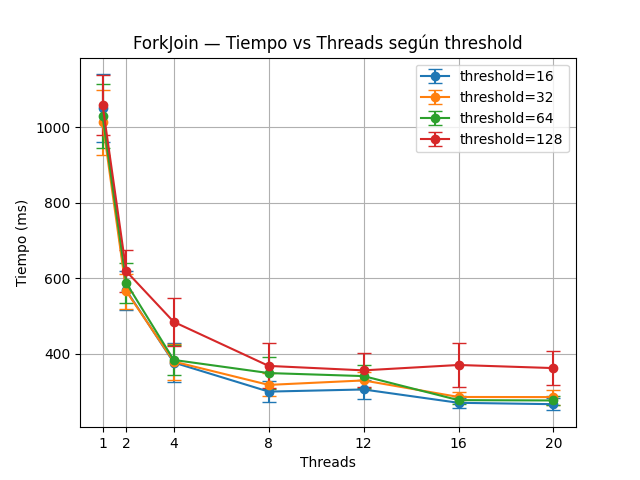
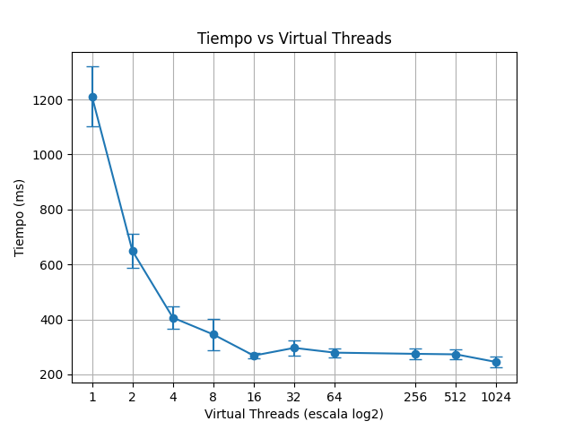
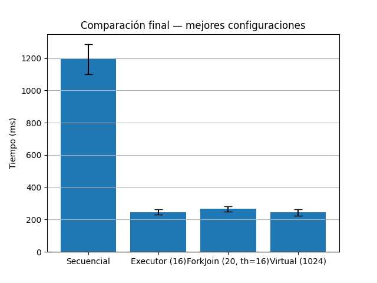

# Actividad Java
Implementaciones secuenciales y paralelas para multiplicación de matrices y N-Queens.

## Hardware y entorno  
**CPU:** AMD Ryzen AI 9 365 — 10 núcleos / 20 hilos — ~1996 MHz  
**SO:** Ubuntu 22.04 (WSL2)  
**Java:** OpenJDK 21

## Punto a - Versión secuencial  
**Archivo:** `src/matrix/MatrixSequential.java`

### Puntos importantes  
- Implementa la multiplicación de matrices 1024×1024 usando triple bucle como en el ejemplo de la consigna.  
- Las matrices se inicializan de forma determinística con `Random(SEED)`.  
- Imprime `C[0][0]` como verificación del resultado y el tiempo de ejecución.

### Cómo ejecutarlo  
Desde el directorio del proyecto:

```bash
./scripts/run_matrix_sequential.sh
```

### Salida esperada

```
Compilando MatrixSequential...
Ejecutando MatrixSequential...
--------------------------------
Fin: 253.90358035476618
Tiempo (ms): 1991.526451
--------------------------------
Ejecución finalizada.
```

## Punto b - Versión paralela con ExecutorService  
**Archivo:** `src/matrix/MatrixExecutor.java`

### Puntos importantes  
- Paraleliza el cálculo por **filas**, enviando cada una como tarea al `ExecutorService` con la funcion `executor.submit`.  
  **Justificación:** Se paraleliza por filas porque cada una se puede calcular de manera completamente independiente y permite generar una cantidad razonable de tareas (una por fila). Paralelizar por columnas también sería igualmente válido. Paralelizar por celdas produciría un número excesivo de tareas muy pequeñas, y paralelizar el bucle interno `k` no tiene sentido conceptual, ya que ese bucle calcula un único valor `C[i][j]`.
 
- Permite configurar la cantidad de hilos desde línea de comandos (primer argumento).  
- Produce el mismo resultado que la versión secuencial y muestra el tiempo de ejecución y la cantidad de hilos utilizados.

### Cómo ejecutarlo  
Con cantidad de hilos específica (ejemplo: 8):

```bash
./scripts/run_matrix_executor.sh 8
```

O usando el valor por defecto (todos los cores disponibles):

```bash
./scripts/run_matrix_executor.sh
```

### Salida esperada
```
Compilando MatrixExecutor...
Ejecutando MatrixExecutor...
--------------------------------
Fin: 253.90358035476618
Tiempo (ms): 366.863845
Threads usados: 8
--------------------------------
Ejecución finalizada.
```

## Punto c - Versión paralela con ForkJoin  
**Archivo:** `src/matrix/MatrixForkJoin.java`

### Puntos importantes  
- Implementa paralelismo usando el framework **ForkJoin**, dividiendo recursivamente el rango de filas en subtareas hasta alcanzar un `threshold` configurable.  
- Permite ajustar tanto la cantidad de hilos como el `threshold` desde la línea de comandos.  
- Produce el mismo resultado que las versiones anteriores y muestra el tiempo de ejecución, los hilos utilizados y el threshold aplicado.

### Cómo ejecutarlo  
Con cantidad de hilos y threshold específicos (ejemplo: 8 hilos, threshold 64):

```bash
./scripts/run_matrix_forkjoin.sh 8 64
```

Usando valores por defecto (todos los cores disponibles y threshold = 64):

```bash
./scripts/run_matrix_forkjoin.sh
```

### Salida esperada

```
Compilando MatrixForkJoin...
Ejecutando MatrixForkJoin...
--------------------------------
Fin: 253.90358035476618
Tiempo (ms): 473.427032
Threads usados: 8
Threshold: 64
--------------------------------
Ejecución finalizada.
```

## Punto e - Versión paralela con Virtual Threads  
**Archivo:** `src/matrix/MatrixVirtual.java`

### Puntos importantes  
- Reimplementa la versión del punto **b)** reemplazando el `ExecutorService` por **virtual threads** utilizando `Thread.startVirtualThread`.  
- Mantiene la misma estrategia de paralelización por filas, pero permite crear cientos o miles de hilos sin costo alto, gracias a que los virtual threads son gestionados por la JVM y no por el sistema operativo.  
- Permite configurar la cantidad de virtual threads desde línea de comandos; si no se indica, se utiliza una virtual thread por fila (1024).  
- Produce el mismo resultado que las versiones anteriores e informa el tiempo de ejecución y la cantidad de hilos virtuales utilizados.

### Cómo ejecutarlo  
Con cantidad específica de virtual threads (ejemplo: 20):

```bash
./scripts/run_matrix_virtual.sh 20
```

Usando valor por defecto (1024 virtual threads, una por fila):

```bash
./scripts/run_matrix_virtual.sh
```

### Salida esperada

```
Compilando MatrixVirtual...
Ejecutando MatrixVirtual...
--------------------------------
Fin: 253.90358035476618
Tiempo (ms): 373.285158
Virtual threads usados: 1024
--------------------------------
Ejecución finalizada.
```

## Punto d - Comparación de tiempos de ejecución  
Para evaluar el rendimiento de las distintas variantes (secuencial, ExecutorService, ForkJoin y Virtual Threads) se desarrolló el script `scripts/benchmarks-matrix.py`, que automatiza todo el proceso de medición y generacion de graficos.

### Cómo funciona el script de benchmarks  
- Ejecuta cada implementación **varias veces** (por defecto 50 runs por configuración) para estimar un tiempo promedio confiable.  
- Calcula automáticamente:
  - **tiempo promedio** de ejecución (mean)  
  - **desvío estándar** (std)  
- Repite las pruebas variando:
  - **cantidad de threads** para ExecutorService  
  - **cantidad de threads y thresholds** para ForkJoin  
  - **cantidad de virtual threads** para la variante con virtual threads  
- Genera gráficos comparativos con **barras de error** para visualizar la variabilidad de los resultados.  
- Produce un gráfico final comparando las **mejores configuraciones** de cada método.

### Sobre la cantidad de ejecuciones  
Se utilizaron **50 ejecuciones por configuración**, lo cual reduce significativamente la variabilidad estadística.  
Se consideró realizar más, pero el costo temporal total aumentaba demasiado.

### Cómo ejecutar el benchmark  
Desde el entorno virtual Python:

```bash
source .venv/bin/activate
python3 scripts/benchmarks-matrix.py
```

Los gráficos generados se guardan automáticamente en el directorio `/plots`

Se pueden variar las configuraciones cambiando la seccion al comienzo del script, las configuraciones utilizadas para los graficos fueron las siguientes:
```python
N_RUNS = 50   # cantidad de ejecuciones para promediar

EXECUTOR_THREADS = [1, 2, 4, 8, 12, 16, 20]
FORKJOIN_THREADS = [1, 2, 4, 8, 12, 16, 20]
FORKJOIN_THRESHOLDS = [16, 32, 64, 128]
VIRTUAL_THREADS = [1, 2, 4, 8, 16, 32, 64, 256, 512, 1024]
```

A continuación se presentan los resultados obtenidos y las conclusiones derivadas de cada gráfico.

### Resultados - ExecutorService


El gráfico muestra cómo varía el tiempo de ejecución al aumentar la cantidad de threads utilizados en la versión paralela con `ExecutorService`.

#### Observaciones principales
- Con **1 thread**, obtenemos el mayor tiempo de ejecucion por gran diferencia.
- El tiempo cae drásticamente al pasar a **2 threads** (~600 ms) y vuelve a reducirse con **4 threads** (~380 ms).
- A partir de **8 threads**, el tiempo se estabiliza entre **250–300 ms**.
- El mejor tiempo medido ocurre alrededor de **16 threads**, con un valor cercano a **250 ms**.

#### Conclusión
El rendimiento mejora significativamente hasta aproximadamente **8 threads**, luego se estabiliza.

### Resultados - ForkJoin



El gráfico muestra el tiempo de ejecución para la versión paralela usando el framework **ForkJoin**, evaluando combinaciones de distintos valores de `threads` y `threshold`.

#### Observaciones principales

- Con **1 thread**, el rendimiento es muy similar al de ExecutorService, superando los **1000 ms**.
- Con **2 threads**, el tiempo cae por debajo de **600 ms**, como en la versión del ExecutorService.
- Entre **4 y 8 threads**, los tiempos nuevamente descienden y se ubican en el rango **400–360 ms**, dependiendo del threshold.
- El mejor desempeño se observa alrededor de **12–16 threads**, donde varios thresholds convergen en valores cercanos a **260–300 ms**.
- El threshold **128** es consistentemente el peor de todos ya que produce los mayores tiempos en todos los niveles de threads debido a que **reduce demasiado la granularidad y genera tareas demasiado grandes**.
- En cambio, los thresholds **16, 32 y 64** tienen desempeños parecidos y buenos, con pequeñas diferencias entre ellos.

#### Conclusión
El framework ForkJoin muestra un patrón muy similar al del ExecutorService: mejora rápida al incrementar la cantidad de hilos hasta aproximadamente **12–16**, donde obtiene su mejor rendimiento. Thresholds demasiado grandes (como 128) perjudican la performance al limitar el grado de división del trabajo. Thresholds más pequeños (16–64) funcionan mejor y producen resultados prácticamente equivalentes entre sí.

En general, ForkJoin no ofrece una ventaja significativa sobre ExecutorService para este problema específico, ya que la multiplicación por filas no se beneficia demasiado del enfoque *divide and conquer*. Sin embargo, demuestra estabilidad y buen rendimiento con thresholds adecuados.

### Resultados - Virtual Threads



Este gráfico muestra cómo varía el tiempo de ejecución al utilizar **virtual threads**, usando una escala logarítmica en el eje X para visualizar adecuadamente configuraciones desde 1 hasta 1024 hilos virtuales.

#### Observaciones principales

- Con **1 virtual thread**, el desempeño es similar a la versión secuencial, superando los **1200 ms**.
- Al aumentar a **2 y 4 virtual threads**, el tiempo cae rápidamente a la región de **600–400 ms**, mostrando un patrón de aceleración muy similar al de los hilos tradicionales.
- A partir de **8 virtual threads**, el tiempo baja a alrededor de **350 ms**, comparable al ExecutorService y ForkJoin.
- A partir de **16 virtual threads** y hasta **1024**, el tiempo se mantiene prácticamente estable entre **230–280 ms**, mostrando que:
  - El scheduling de virtual threads escala muy bien.
  - Crear cientos o miles de virtual threads **no introduce penalidades significativas**.
- El mejor tiempo medido se encuentra alrededor de **1024 virtual threads**, cercano a **230ms**.

#### Conclusión
Los virtual threads muestran un comportamiento de escalabilidad muy estable. A diferencia de los hilos tradicionales, donde el overhead del sistema operativo limita el paralelismo más allá de cierto punto, los virtual threads permiten crear cientos o miles de hilos sin costo significativo. Esto produce:

- Rendimiento levemente mejor que ExecutorService y ForkJoin.
- Muy poco overhead agregado incluso con **1024 hilos virtuales**, algo impráctico con platform threads.

En este problema particular, los virtual threads logran un rendimiento **ligeramente superior** a las otras alternativas, sobre todo cuando se utilizan cantidades grandes de hilos virtuales.

### Comparación final — Mejores configuraciones



El gráfico resume el mejor desempeño alcanzado por cada implementación:

- **Secuencial:** ~1200 ms  
- **ExecutorService (16 threads):** ~250 ms  
- **ForkJoin (20 threads, threshold=16):** ~270 ms  
- **Virtual Threads (1024 threads):** ~250 ms  

#### Observaciones principales

- La versión secuencial es la más lenta con una diferencia marcada respecto de todas las demás alternativas paralelas.
- Tanto ExecutorService como ForkJoin logran tiempos muy similares, alrededor de **250ms**, lo cual confirma que el problema (multiplicación de matrices por filas) no se beneficia especialmente del enfoque divide-and-conquer de ForkJoin.
- La variante con **virtual threads** alcanzó un tiempo muy similar al del ExecutorService, demostrando que los virtual threads escalan de forma eficiente y que el costo de crear cientos o miles de hilos virtuales es bajo.
- El desvío estándar en las versiones paralelas es bajo, reflejando una estabilidad temporal consistente.

#### Conclusión general del punto d)

Las tres variantes paralelas logran una gran mejora de aproximadamente respecto de la versión secuencial.  
ExecutorService, ForkJoin y Virtual Threads ofrecen desempeños similares y los virtual threads muestran un comportamiento estable incluso con cantidades muy grandes de hilos.